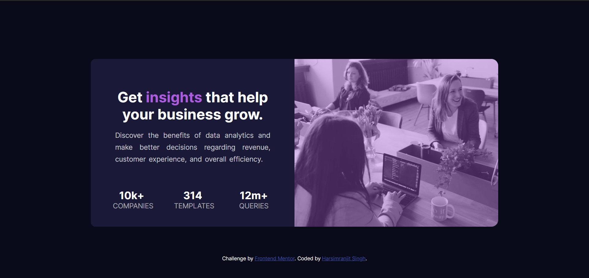

# Frontend Mentor - Stats preview card component solution

This is a solution to the [Stats preview card component challenge on Frontend Mentor](https://www.frontendmentor.io/challenges/stats-preview-card-component-8JqbgoU62). Frontend Mentor challenges help you improve your coding skills by building realistic projects. 

## Table of contents

- [Overview](Responsive Card Component)
  - [The challenge](Stats preview card component)
  - [Screenshot](images/Screenshot-sol.jpg)
  - [Links](https://github.com/harsimranjit27/FrontEndMentor-Challenges_Basic)
- [My process](#my-process)
  - [Built with](VS Code)
  - [What I learned](Responsive design)
  - [Continued development](#continued-development)
  - [Useful resources](Stackoverflow)
- [Author](Harsimranjit Singh)
- [Acknowledgments](Neeraj Gupta)

**Note: Delete this note and update the table of contents based on what sections you keep.**

## Overview

### The challenge

Users should be able to:

- View the optimal layout depending on their device's screen size

### Screenshot

<!-- Alternatively, you can use a tool like [FireShot](https://getfireshot.com/) to take the screenshot. FireShot has a free option, so you don't need to purchase it.  -->

<!-- Then crop/optimize/edit your image however you like, add it to your project, and update the file path in the image above. -->

**Note: Delete this note and the paragraphs above when you add your screenshot. If you prefer not to add a screenshot, feel free to remove this entire section.**

### Links

- Solution URL: [Add solution URL here](https://github.com/harsimranjit27/FrontEndMentor-Challenges_Basic)
- Live Site URL: [Add live site URL here](https://github.com/harsimranjit27/FrontEndMentor-Challenges_Basic)

## My process

### Built with

- Semantic HTML5 markup
- CSS custom properties
- Flexbox
- Mobile-first workflow
- [Styled Components](https://styled-components.com/) - For styles

**Note: These are just examples. Delete this note and replace the list above with your own choices**

### What I learned

My learings:-
- How media queries work for making responsive website.
- How to add color filter on image.
- Got a good overview of CSS properties.

**Note: Delete this note and the content within this section and replace with your own learnings.**

### Continued development

- Responsive design
- Dynamic sizes

**Note: Delete this note and the content within this section and replace with your own plans for continued development.**

### Useful resources

- [Stack overflow](https://stackoverflow.com/) 
- [W3 Schools](https://www.w3schools.com) 

**Note: Delete this note and replace the list above with resources that helped you during the challenge. These could come in handy for anyone viewing your solution or for yourself when you look back on this project in the future.**

## Author

- Frontend Mentor - [@harsimranjit27](https://www.frontendmentor.io/profile/harsimranjit27)
- Twitter - [@harsimran_27](https://twitter.com/harsimran_27)

**Note: Delete this note and add/remove/edit lines above based on what links you'd like to share.**

## Acknowledgments

Thanks to @Neeraj15022001 for helping me in adding color filter on image.

**Note: Delete this note and edit this section's content as necessary. If you completed this challenge by yourself, feel free to delete this section entirely.**
